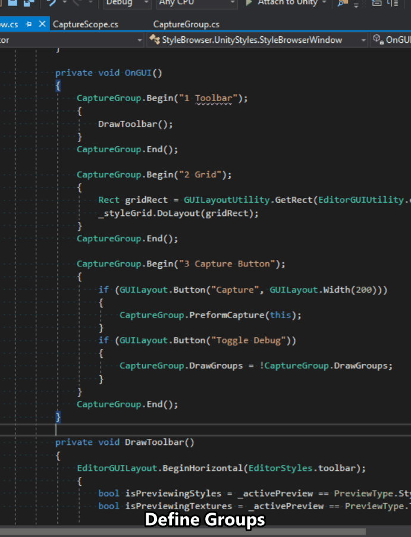

# Capture Groups
An easy to use Editor Tool for taking IMGUI screen shots for [Editor Windows](https://docs.unity3d.com/Manual/editor-EditorWindows.html).


##### Demo


## How to Use

To use capture groups is quite simple. Using the GUILayout system you must surround your code with the `CaptureGroup.Begin(string savePath)` and `CaptureGroup.End()`. This will mark your region as a group to be captured.

To take the screen shots call `CaptureGroup.PreformCaputre(EditorWindow window)`. This will then save all the captures to disk at their defined path.

## Sudo
Here is a block of example code
```csharp
private class MyEditorWindow : EditorWindow
{
    /// <summary>
    /// Invoked by Unity to draw element for an editor window.
    /// </summary>
    public void OnGUI()
    {
        // Mark the start of a group
        CaptureGroup.Begin("Assets/ScreenShots/Label.png");
        {   
            // Everything inside here will be in the picture.
            GUILayout.Label("Hello World");
        }
        CaptureGroup.End();
        // The end of the picture.
        
        // A button to invoke the capture process
        if(GUILayout.Button("Preform Capture"))
        {
            // Start the capture.
            CaptureGroup.PreformCapture(this);
        }
    }
}
```

## Debug
To visualize the captures use the `CaptureGroup.ShowDebug` option which will draw the green overlay.

## In Development 
* The option to take a full screen shot and instead of cropping it draw a GUIStyle around the element. 


